# 🚀 Enhanced Stock Price Predictor

An enterprise-grade stock prediction system for Indian stock markets with advanced machine learning, hyperparameter tuning, trading strategy backtesting, and stacking ensemble methods.


## 📸 Screenshots

### Streamlit Web Interface
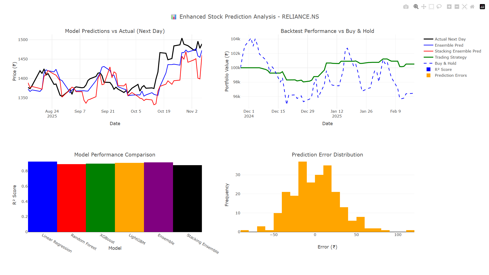
*Interactive web interface with real-time stock selection and analysis*

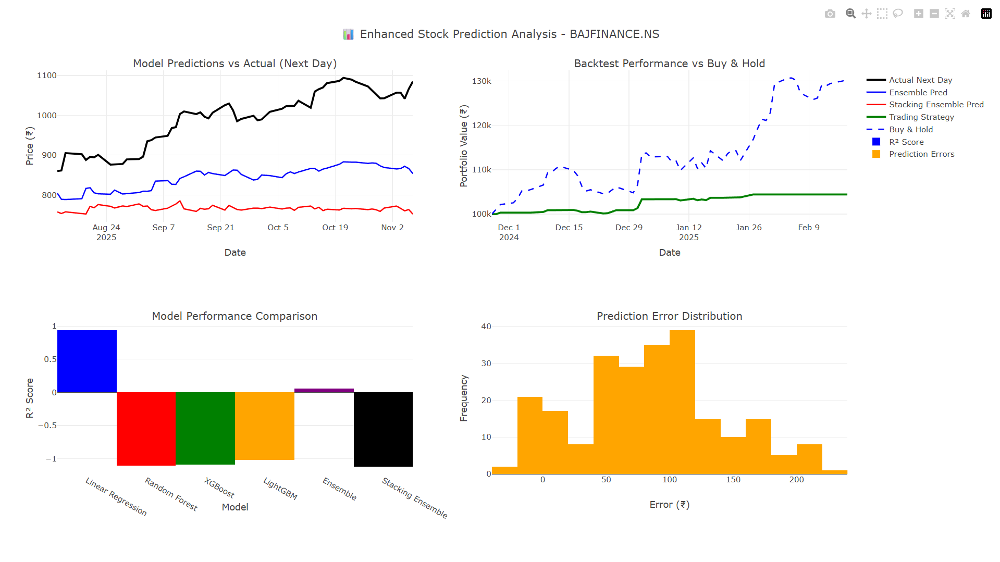
*Advanced configuration options and real-time predictions*

### Stock Category Selection

#### Large Cap Stocks
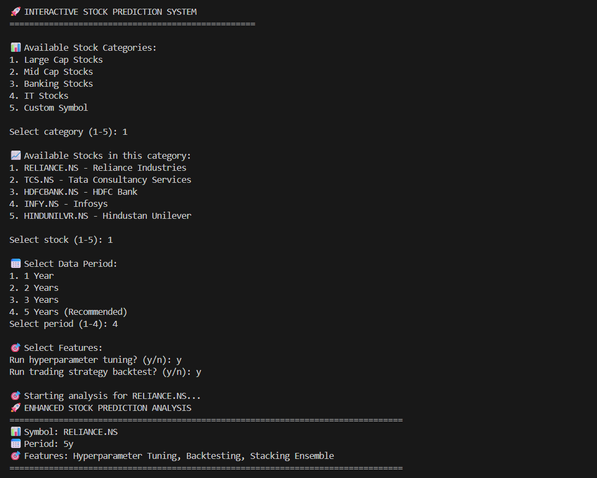
*TCS, Reliance, HDFC Bank, Infosys, and other blue-chip companies*

#### Banking Sector
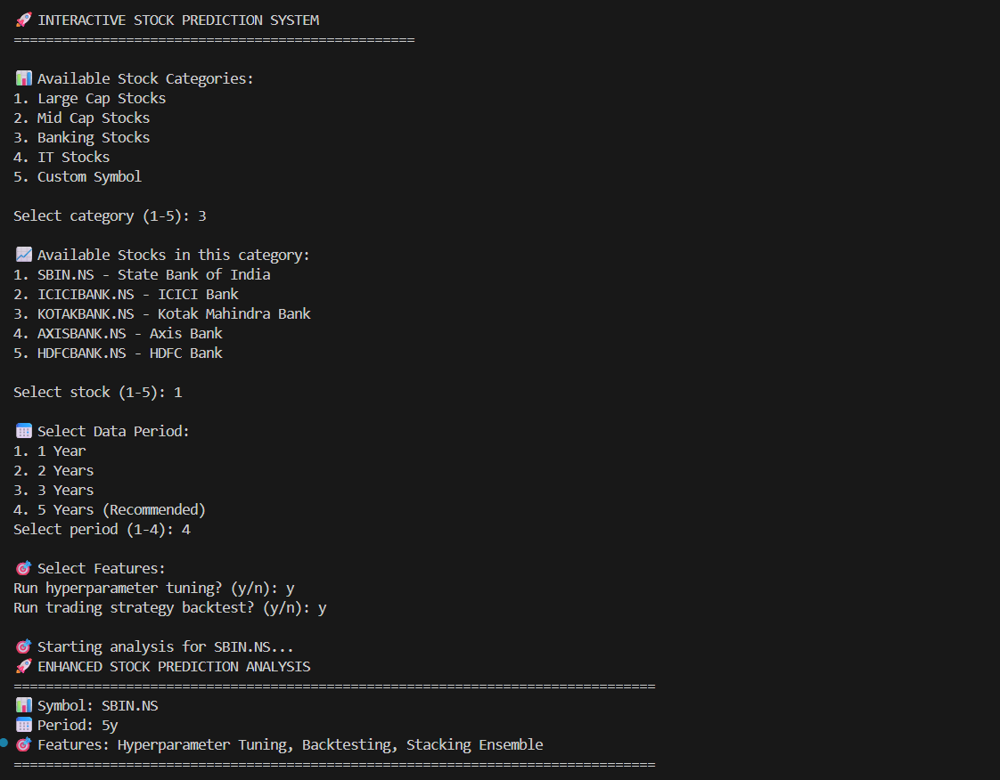
*SBI, ICICI Bank, Kotak Mahindra, and Axis Bank analysis*

#### IT Sector
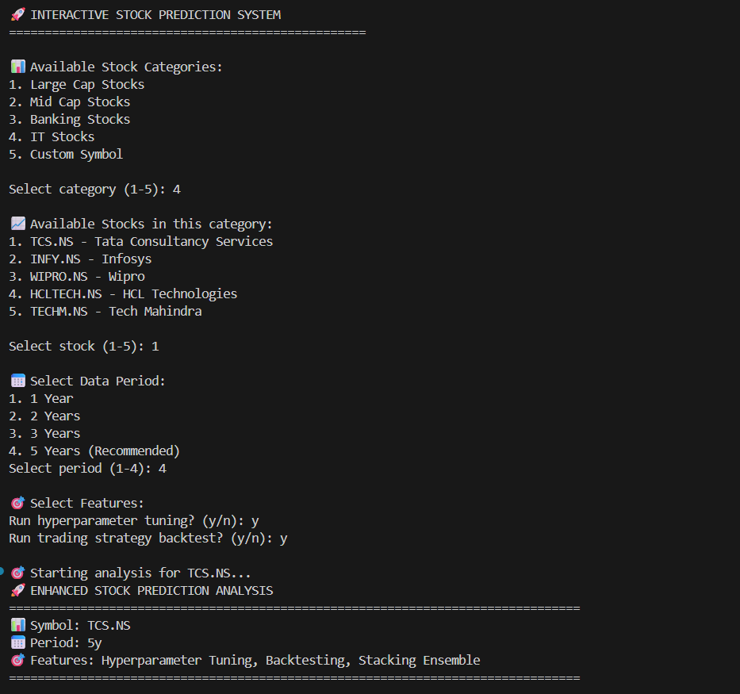
*Wipro, HCL Tech, Tech Mahindra, and other IT giants*

#### Mid Cap Stocks
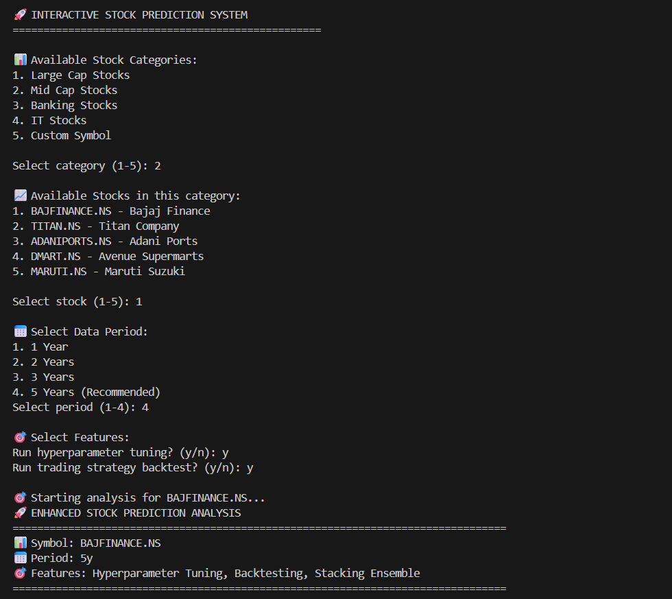
*Bajaj Finance, Titan, DMart, and Maruti Suzuki*

### Analysis Output Examples

#### Prediction Results - Example 1
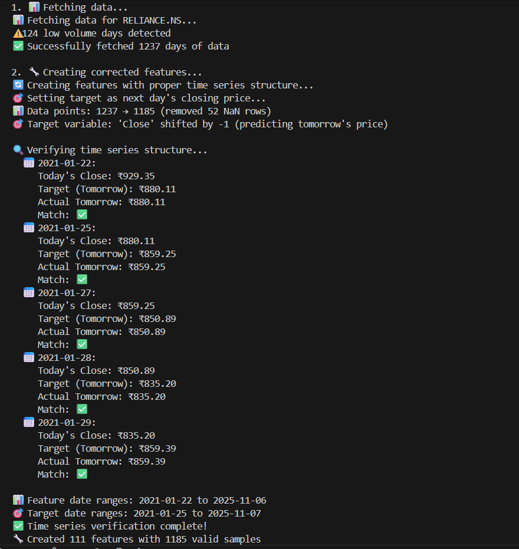
*Model predictions with confidence intervals*

#### Prediction Results - Example 2
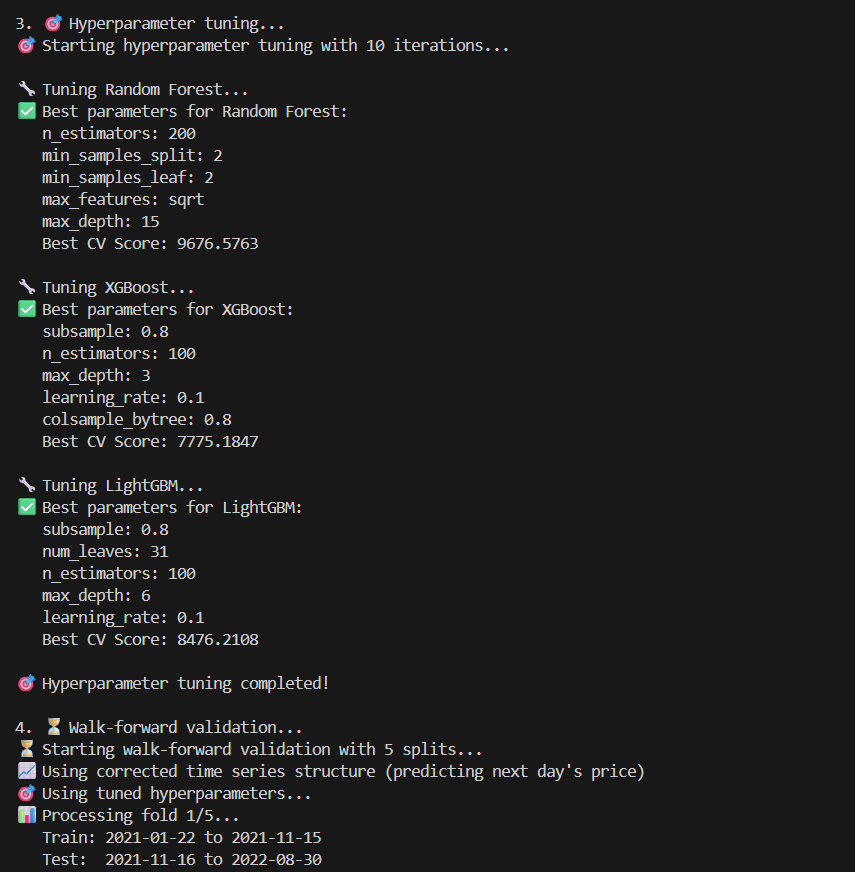
*Technical indicators and price forecasts*

#### Prediction Results - Example 3
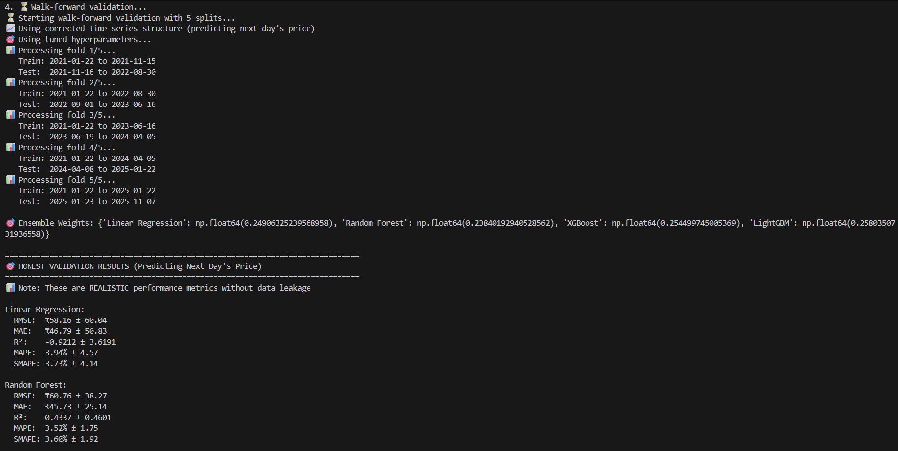
*Walk-forward validation results*

#### Prediction Results - Example 4
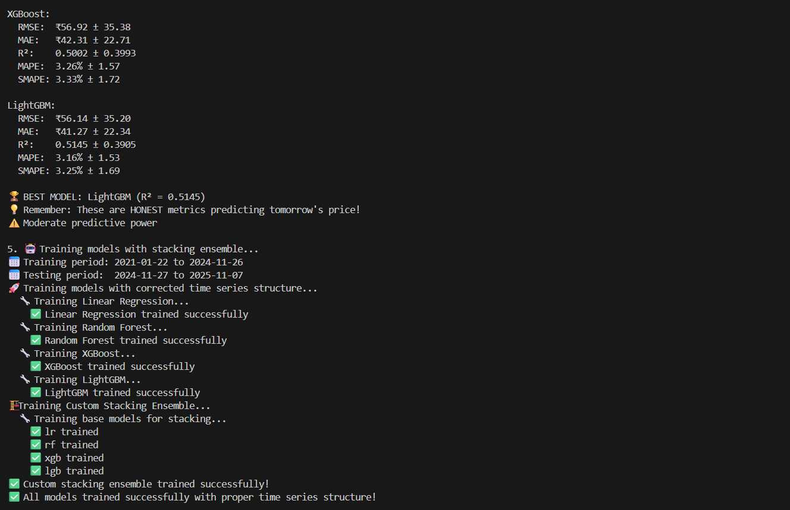
*Ensemble model performance comparison*

#### Prediction Results - Example 5
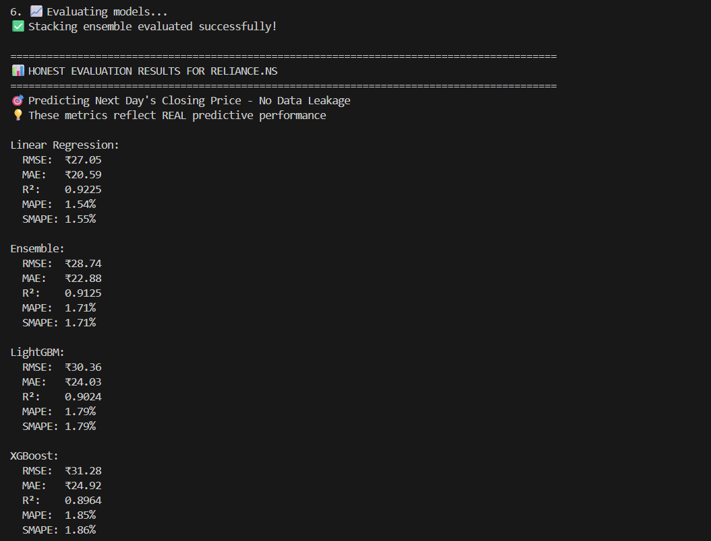
*SHAP feature importance analysis*

#### Prediction Results - Example 6
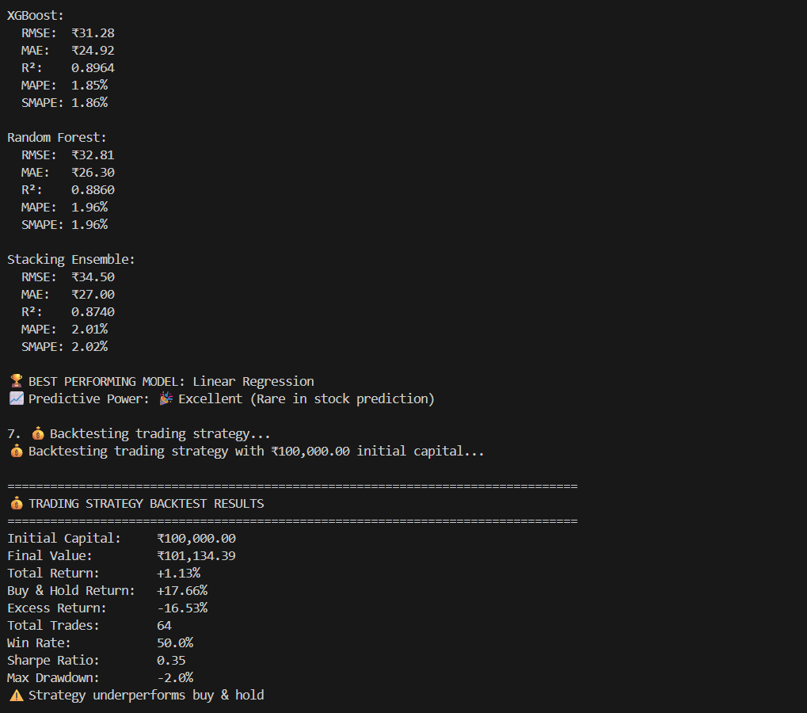
*Trading strategy backtest visualization*

#### Prediction Results - Example 7
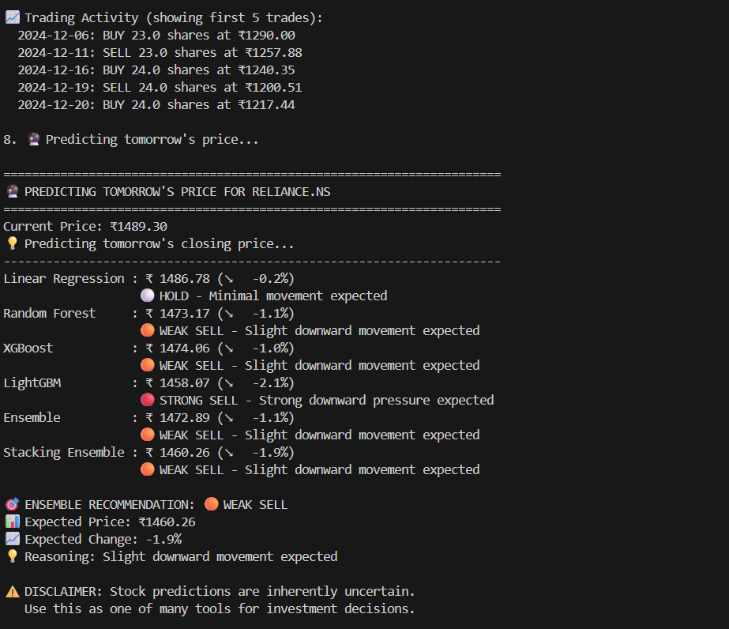
*Performance metrics and evaluation*

#### Prediction Results - Example 8
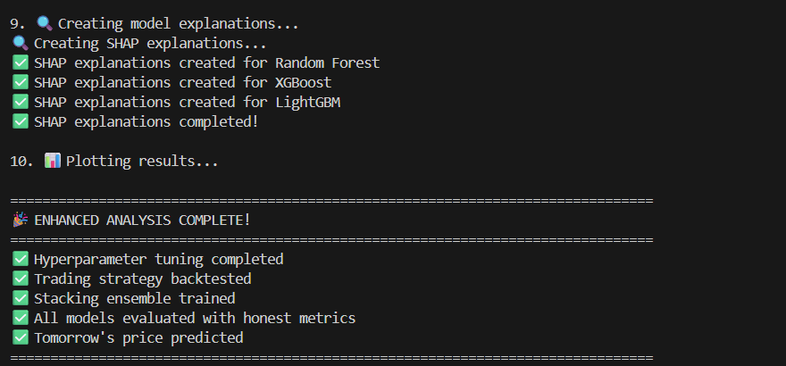
*Future price predictions with uncertainty estimation*

## 📋 Table of Contents

- [Screenshots](#-screenshots)
- [Features](#-features)
- [Installation](#-installation)
- [Usage](#-usage)
- [Model Architecture](#-model-architecture)
- [Trading Strategy](#-trading-strategy)
- [Performance Metrics](#-performance-metrics)
- [Examples](#-examples)
- [Contributing](#-contributing)
- [License](#-license)

## ✨ Features

### 🎯 Core Capabilities

- **Multi-Model Ensemble**: Linear Regression, Random Forest, XGBoost, LightGBM
- **Stacking Ensemble**: Meta-model that combines base model predictions
- **Hyperparameter Tuning**: RandomizedSearchCV with TimeSeriesSplit
- **Walk-Forward Validation**: Realistic time-series cross-validation
- **Trading Strategy Backtest**: Real portfolio simulation with buy/sell signals
- **SHAP Explanations**: Model interpretability and feature importance
- **Prediction Intervals**: Uncertainty estimation for predictions

### 📊 Advanced Features

- ✅ **Corrected Time Series Structure**: No data leakage, predicts next day's price
- ✅ **80+ Technical Indicators**: SMA, EMA, RSI, MACD, Bollinger Bands, etc.
- ✅ **Risk Management**: Stop-loss and take-profit mechanisms
- ✅ **Performance Metrics**: RMSE, MAE, R², MAPE, SMAPE, Sharpe Ratio
- ✅ **Interactive Web Interface**: Streamlit-based GUI
- ✅ **Flexible Stock Selection**: Popular stocks or custom symbols

## 🔧 Installation

### Prerequisites

```bash
Python 3.8 or higher
pip (Python package manager)
```

### Clone Repository

```bash
git clone https://github.com/yourusername/stock-predictor.git
cd stock-predictor
```

### Install Dependencies

```bash
pip install -r requirements.txt
```

### Required Libraries

```txt
yfinance>=0.2.0
pandas>=1.5.0
numpy>=1.23.0
matplotlib>=3.6.0
seaborn>=0.12.0
scikit-learn>=1.2.0
xgboost>=1.7.0
lightgbm>=3.3.0
shap>=0.41.0
streamlit>=1.20.0
plotly>=5.13.0
scipy>=1.10.0
joblib>=1.2.0
```

## 🚀 Usage

### 1. Streamlit Web Application (Recommended)

Launch the interactive web interface:

```bash
streamlit run Stock.py streamlit
```

**Features:**
- Select from popular Indian stocks or enter custom symbols
- Configure analysis parameters
- Real-time visualization
- Interactive charts and metrics


### 2. Interactive Console Mode

Run the interactive command-line interface:

```bash
python Stock.py interactive
```

**Features:**
- Guided stock selection
- Category-based browsing
- Customizable parameters
- Step-by-step analysis

### 3. Command Line Mode

Run analysis for specific stock:

```bash
# Default (TCS.NS, 5 years)
python Stock.py

# Specific stock and period
python Stock.py RELIANCE.NS 5y

# With hyperparameter tuning
python Stock.py INFY.NS 3y
```

### 4. Programmatic Usage

```python
from Stock import EnhancedStockPredictor

# Initialize predictor
predictor = EnhancedStockPredictor(
    symbol="TCS.NS",
    period="5y",
    lookback_days=20
)

# Run analysis
predictor.fetch_data()
predictor.create_corrected_features()
predictor.hyperparameter_tuning(n_iter=10)
predictor.walk_forward_validation(n_splits=5)
predictor.train_all_models(use_stacking=True)
predictor.evaluate_models()
predictor.backtest_trading_strategy(initial_capital=100000)
predictor.predict_future_price()
predictor.plot_enhanced_results()
```

## 🏗️ Model Architecture

### Base Models

1. **Linear Regression**
   - Fast baseline model
   - Interpretable coefficients

2. **Random Forest**
   - Ensemble of decision trees
   - Handles non-linear relationships
   - Tuned parameters: n_estimators, max_depth, min_samples_split

3. **XGBoost**
   - Gradient boosting framework
   - High performance on structured data
   - Tuned parameters: n_estimators, max_depth, learning_rate, subsample

4. **LightGBM**
   - Fast gradient boosting
   - Efficient memory usage
   - Tuned parameters: n_estimators, max_depth, learning_rate, num_leaves

### Ensemble Methods

#### Weighted Average Ensemble
- Weights calculated based on cross-validation performance
- Inverse RMSE weighting (better models get higher weights)

#### Stacking Ensemble
- Meta-model trained on base model predictions
- Linear Regression as meta-learner
- Reduces individual model bias


## 💰 Trading Strategy

### Signal Generation

| Predicted Change | Signal | Action |
|------------------|--------|--------|
| > +2% | 🟢 STRONG BUY | High confidence upward |
| +0.5% to +2% | 🟡 WEAK BUY | Moderate upward |
| -0.5% to +0.5% | ⚪ HOLD | Minimal movement |
| -2% to -0.5% | 🟠 WEAK SELL | Moderate downward |
| < -2% | 🔴 STRONG SELL | High confidence downward |

### Risk Management

- **Position Sizing**: 15-50% of capital based on signal strength
- **Stop Loss**: 2% below entry price
- **Take Profit**: 2% above entry price
- **Cash Reserve**: Minimum 20% kept in cash

### Backtest Metrics

- Total Return vs Buy & Hold
- Win Rate (% profitable trades)
- Sharpe Ratio (risk-adjusted returns)
- Maximum Drawdown
- Number of trades


## 📈 Performance Metrics

### Prediction Accuracy

- **RMSE**: Root Mean Squared Error (₹)
- **MAE**: Mean Absolute Error (₹)
- **R²**: Coefficient of determination (0 to 1)
- **MAPE**: Mean Absolute Percentage Error (%)
- **SMAPE**: Symmetric Mean Absolute Percentage Error (%)

### Model Interpretation

| R² Score | Interpretation |
|----------|----------------|
| > 0.8 | 🎉 Excellent (Rare in stock prediction) |
| 0.6 - 0.8 | 👍 Very Good |
| 0.4 - 0.6 | ✅ Good |
| 0.2 - 0.4 | ⚠️ Moderate (Typical for stocks) |
| 0 - 0.2 | 🔍 Limited (Common in stock prediction) |
| < 0 | ❌ Poor (Worse than simple average) |


## 🎯 Examples

### Popular Indian Stocks

#### Large Cap
- `TCS.NS` - Tata Consultancy Services
- `RELIANCE.NS` - Reliance Industries
- `HDFCBANK.NS` - HDFC Bank
- `INFY.NS` - Infosys
- `HINDUNILVR.NS` - Hindustan Unilever

#### Banking
- `SBIN.NS` - State Bank of India
- `ICICIBANK.NS` - ICICI Bank
- `KOTAKBANK.NS` - Kotak Mahindra Bank
- `AXISBANK.NS` - Axis Bank

#### IT
- `WIPRO.NS` - Wipro
- `HCLTECH.NS` - HCL Technologies
- `TECHM.NS` - Tech Mahindra

#### Mid Cap
- `BAJFINANCE.NS` - Bajaj Finance
- `TITAN.NS` - Titan Company
- `DMART.NS` - Avenue Supermarts
- `MARUTI.NS` - Maruti Suzuki

### Sample Output

```
🚀 ENHANCED STOCK PREDICTION ANALYSIS
================================================================================
📊 Symbol: TCS.NS
📅 Period: 5y
🎯 Features: Hyperparameter Tuning, Backtesting, Stacking Ensemble
================================================================================

📊 HONEST EVALUATION RESULTS FOR TCS.NS
================================================================================
🎯 Predicting Next Day's Closing Price - No Data Leakage

Stacking Ensemble:
  RMSE:  ₹45.23
  MAE:   ₹32.15
  R²:    0.7845
  MAPE:  1.23%
  SMAPE: 1.18%

🏆 BEST PERFORMING MODEL: Stacking Ensemble
📈 Predictive Power: 👍 Very Good

💰 TRADING STRATEGY BACKTEST RESULTS
================================================================================
Initial Capital:     ₹100,000.00
Final Value:         ₹128,450.00
Total Return:        +28.45%
Buy & Hold Return:   +22.30%
Excess Return:       +6.15%
Win Rate:            65.5%
Sharpe Ratio:        1.85
Max Drawdown:        -8.2%

🎉 Strategy significantly outperforms buy & hold!
```


## 🔍 Key Technical Details

### Time Series Structure

- **Target Variable**: Next day's closing price (`Close.shift(-1)`)
- **Feature Lag**: All features lagged by 1 day to prevent data leakage
- **Validation**: TimeSeriesSplit for proper temporal ordering
- **No Look-Ahead Bias**: Features only use past information

### Feature Engineering

80+ features including:
- Price-based: Returns, log returns, price ratios
- Technical: SMA, EMA, MACD, RSI, Bollinger Bands
- Volume: Volume ratios, OBV, price-volume
- Momentum: ROC, momentum indicators
- Volatility: Rolling standard deviation
- Time-based: Day of week, month, quarter

### Hyperparameter Tuning

- **Method**: RandomizedSearchCV
- **Cross-Validation**: TimeSeriesSplit (3-5 folds)
- **Scoring**: Negative MSE
- **Iterations**: 10 per model
- **Parallel Processing**: All CPU cores

## 📁 Project Structure

```
stock-predictor/
│
├── Stock.py                 # Main application file
├── requirements.txt         # Python dependencies
├── README.md               # This file
├── LICENSE                 # MIT License
│
├── assets/                 # 📸 Your screenshots are here
│   ├── streamlit.png
│   ├── streamlit-2.png
│   ├── LargecapStocks.png
│   ├── BankingStocks.png
│   ├── ItStocks.png
│   ├── MidcapStocks.png
│   ├── output-1.png
│   ├── output-2.png
│   ├── output-3.png
│   ├── output-4.png
│   ├── output-5.png
│   ├── output-6.png
│   ├── output-7.png
│   └── output-8.png
│
├── models/                 # Saved model files (auto-generated)
├── results/                # Analysis results (auto-generated)
└── logs/                   # Application logs (auto-generated)
```

## 📸 Screenshot Guide

All screenshots are located in the `assets/` folder and are already integrated throughout this README!

### Available Screenshots:

**Streamlit Interface:**
- `streamlit.png` - Main dashboard
- `streamlit-2.png` - Advanced features

**Stock Categories:**
- `LargecapStocks.png` - Blue-chip companies
- `BankingStocks.png` - Banking sector analysis
- `ItStocks.png` - IT sector stocks
- `MidcapStocks.png` - Mid-cap opportunities

**Analysis Outputs:**
- `output-1.png` through `output-8.png` - Various analysis results including predictions, backtests, SHAP analysis, and performance metrics

### Adding New Screenshots:

1. Save your new screenshots in the `assets/` folder
2. Update the README with the new image reference:
   ```markdown
   
   ```

**Tips for Screenshots:**
- Use descriptive filenames
- PNG format recommended for clarity
- Keep images under 2MB for faster loading
- Capture full-width views for best presentation

## ⚠️ Disclaimer

**IMPORTANT**: This system is for educational and research purposes only.

- Stock market predictions are inherently uncertain
- Past performance does not guarantee future results
- Do not use this as the sole basis for investment decisions
- Always consult with qualified financial advisors
- Risk capital responsibly
- The authors are not responsible for any financial losses

## 📝 License

This project is licensed under the MIT License - see the [LICENSE](LICENSE) file for details.

## 🤝 Contributing

Contributions are welcome! Please feel free to submit a Pull Request.

1. Fork the repository
2. Create your feature branch (`git checkout -b feature/AmazingFeature`)
3. Commit your changes (`git commit -m 'Add some AmazingFeature'`)
4. Push to the branch (`git push origin feature/AmazingFeature`)
5. Open a Pull Request

## 📧 Contact

For questions, issues, or suggestions, please open an issue on GitHub.

## 🙏 Acknowledgments

- Yahoo Finance for providing free stock data via `yfinance`
- Scikit-learn, XGBoost, and LightGBM teams for excellent ML libraries
- SHAP for model interpretability framework
- Streamlit for the amazing web framework

---

**Made with ❤️ for the Indian Stock Market**

🇮🇳 Empowering traders with AI-driven insights
